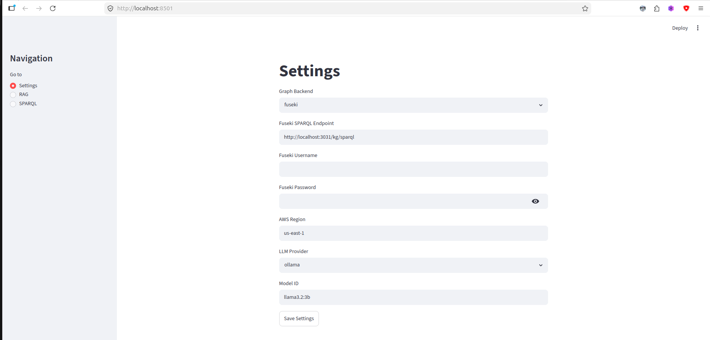
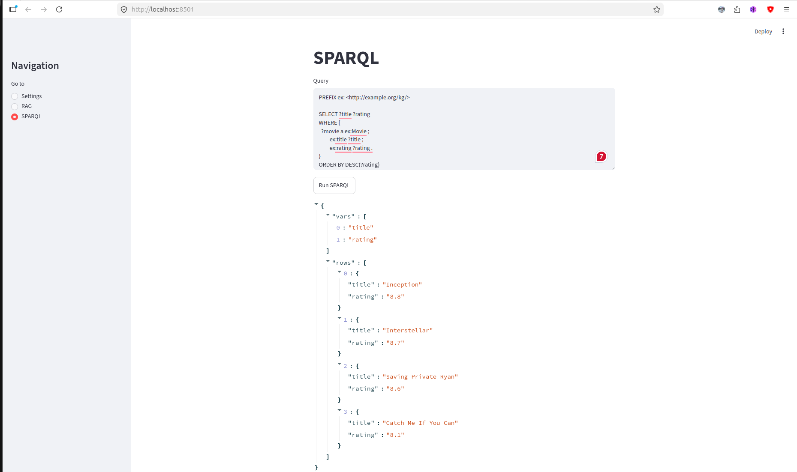
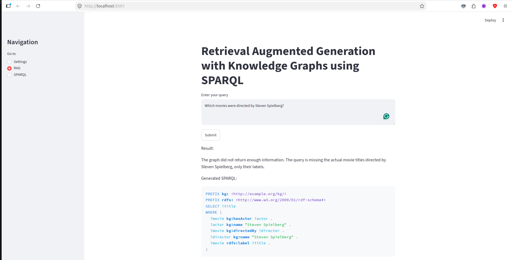

# Retrieval Augmented Generation (RAG) with Knowledge Graph using SPARQL 

## Retrieval Augmented Generation (RAG)

**Retrieval Augmented Generation (RAG)** combines large language models (LLMs) with external knowledge sources such as vector data stores or knowledge graphs to improve response quality and informativeness.  Traditional LLMs can be limited by their training data as even though they are pretrained on large amounts of data, they are designed for generalization purposes and are not trained for extensive domain specific knowledge. RAG addresses this by retrieving relevant information (passages, facts) from external knowledge sources to augment the input for the LLM to return domain specific responses. This allows LLMs to generate more comprehensive and contextually aware responses in tasks like question answering, summarization and text generation.

## Why RAG with Knowledge Graph?

While vector databases are commonly used as external knowledge sources for RAG architectures, knowledge graphs offer distinct advantages in specific scenarios. Let's delve into when a knowledge graph might be a better fit. 

- **Structured Knowledge Representation**: Knowledge graphs represent information in a structured way, using entities, relationships, and properties. This structure enables more precise and interpretable representation of knowledge, which is particularly useful for domains with complex and interconnected concepts, such as healthcare, finance, or scientific domains.
- **Reasoning and Inference**: Knowledge graphs allow for reasoning and inference over the represented knowledge due to their capability of understanding intracies between different relationships in the data i.e. *Product* and *Customer*. This capability enables systems to draw logical conclusions, uncover implicit relationships, and answer complex queries that require combining multiple pieces of information. This paves the way for powerful recommendation systems that can truly personalize user experiences. Knowledge Vector databases, on the other hand, are primarily designed for similarity-based retrieval and lack this reasoning capability.
- **Multi-hop Question Answering**: Knowledge graphs excel at answering multi-hop questions, where the answer requires traversing multiple relationships or combining information from different parts of the knowledge base. This is particularly useful in domains with intricate relationships where understanding the connections between entities is crucial. For instance, in the healthcare domain, responding to a query like "What medications should be avoided for patients with a specific genetic mutation and a certain comorbidity?" would require integrating insights from different sections of the knowledge graph. 
- **Explainability and Provenance**: Knowledge graphs provide explainability by revealing the reasoning path and provenance of the information used to generate an answer. This transparency is valuable in applications where interpretability and traceability are essential, such as decision support systems or regulatory compliance scenarios.
- **Domain-specific Knowledge Integration**: Knowledge graphs can effectively integrate and represent domain-specific knowledge from various sources, such as ontologies, taxonomies, or expert-curated knowledge bases. This capability is advantageous in domains with well-established domain models or when incorporating specialized knowledge is necessary.

While vector databases are efficient for similarity-based retrieval and can work well in certain domains, knowledge graphs offer advantages in representing complex, structured knowledge, enabling reasoning and inference, and providing explainability and provenance. Therefore, RAG with knowledge graphs is particularly suitable for domains with intricate relationships, multi-hop question answering requirements, or where interpretability and integration of domain-specific knowledge are crucial.

## Architecture

This project now supports two learning/deployment paths.

The **local path** uses Apache Jena Fuseki as the SPARQL database, Streamlit as the UI, and Ollama/OpenAI/Bedrock as the LLM provider:

```text
User question
  -> Streamlit
  -> LLM generates read-only SPARQL
  -> Fuseki runs SPARQL against the RDF knowledge graph
  -> LLM writes an answer from the SPARQL result context
```

The **AWS path** uses Amazon Bedrock and Amazon Neptune. Use it later when your AWS account can create Neptune resources.

The original AWS architecture leverages a Large Language Model (LLM) from Amazon Bedrock and a knowledge graph stored in Amazon Neptune containing data from the Internet Movie Database (IMDb). IMDb is an user-contributed online database that provides comprehensive information about movies, TV shows, and other entertainment media.

While LLMs are trained on massive datasets, they often struggle with specific industry knowledge. This RAG architecture addresses this by allowing our LLM to access and leverage data from IMDb, enabling it to provide more informative and entertainment-focused responses.

Architecture has the following components:
- **Amazon VPC**: Virtual Private Cloud to launch resources in logically isolated virtual network.
- **Amazon EC2**: Web server for Streamlit chatbot application.
- **AWS Systems Manager**: Operation hub used for SSH tunneling to privately access EC2 Web server for secure connection.
- **Amazon S3**: Object store for Resource Description Framework (RDF) formatted IMDb dataset.
- **Amazon Neptune**: Graph database service ingests IMDb dataset from S3 bucket to create a Knowledge Graph.
- **Amazon VPC Gateway Endpoint**: Interface to allow dedicated private web connection between S3 and VPC to faciltate secure data transfer between S3 and Neptune.
- **Amazon Bedrock**: LLM hosting service which calls LLM to query Knowledge Graph to retrieve additonal context for response augmentation.


# Fundamental Concepts

To ensure a deeper understanding and maximize your learning from this exercise, let's review key foundational concepts explored in this sample. Feel free to skip this section if you already have a solid understanding of Graph Database and Knowledge Graph concepts.

## Graph Database

A **graph database** is a systematic collection of data that emphasizes the relationships between the different data entities. The NoSQL database uses mathematical graph theory to show data connections which makes it easier to model and mange higly connected data. Unlike relational databases, which store data in rigid table structures, graph databases store data as a network of entities and relationships. Graph databases are purpose-built to store and navigate relationships. As a result, these databases often provide better performance and flexibility as they are more suited for modeling real-world scenarios.

Graph databases offer optimal performance for the following **use cases**:
- **Fraud detection**
- **Social Media Applications**
- **Recommendation Engines**
- **Route Optimization**
- **Knowledge Management**
- **Pattern Discovery**

## Knowledge Graph

A **Knowledge graph** is built via graph database by linking entities and their relationships, often through data extraction from various sources and manual curation by domain experts. Knowledge graph provides a flexible way to structure and connect information, making it easier to understand and access for everyone in an organization. Compared to traditional relational databases, graph databases are better suited for modeling complex real-world data with its inherent diversity. Traditional relational database focuses on storing data points while a knowledge graph capture the relationships and meaning between them. This "semantic" approach allows us to model real-world complexities and unlock hidden connections.  Furthermore, a knowledge graph can integrate information from various sources, structured or unstructured, creating a holistic view. This empowers organizations to not only access information easily to enable powerful applications but also leverage automated reasoning to uncover valuable insights they might have otherwise missed.

There are two main types of knowledge graph models which are **Property Graph** and **Resource Description Framework (RDF) Graph**. Here is a brief summary describing each of those graph models.

- **Property Graph**
    - Focuses on **entities (nodes)** and the **relationships (edges)** between them. Nodes and edges can have properties associated with them, allowing for rich descriptions.
    - Queried by languages like **OpenCypher** or **Gremlin**
    - Known for querying simplicity within single knowledge source
    
- **RDF Graph**
    - Represents information as **entities (resources)**, **properties (attributes)**, and **relationships**. Entities and properties are identified using **URIs (Uniform Resource Identifiers)**, ensuring a standardized format.
    - Queried by **SPARQL** language. 
    - Known for standardization across global knowledge sources. 

For the purposes of this sample, we will focus on RDF graph as it provides the standardization required for enterprise scalability where data integration from multiple sources is necessary.

## Resource Description Framework (RDF) Data Model


The **Resource Description Framework (RDF)** is a standard data model defined by the **World Wide Web Consortium (W3C)** for representing information on the web. RDF graphs are created from this data model. It is based on the idea of making statements about resources in the form of subject-predicate-object expressions, known as triples. Here's a brief explanation:

- **Subject**: Represents the entity or resource you're describing. This entity is identified using a Uniform Resource Identifier (URI), which acts like a unique web address for the resource. Examples of URIs include web page URLs or identifiers created specifically for entities within an RDF graph.
- **Predicate**: Defines the relationship between the subject and the object. It's still a concept or property but also identified using a URI. These URIs act like a vocabulary of terms to describe the relationships precisely.
- **Object**: Provides the value of the property/attribute or relationship defined by the predicate. This can be:
    - Another resource identified by a URI (e.g., connecting to another entity in the graph).
    - A literal value (like a number or text string) enclosed in quotes (e.g., "Paris").
    - Another RDF statement (for very complex relationships).

For example, consider the statement: *"Brussels is a city in Belgium"*. In RDF, this would be represented as:

```text
  <http://example.org/brussels> <http://www.w3.org/1999/02/22-rdf-syntax-ns#type> <http://schema.org/City> .
  <http://example.org/brussels> <http://dbpedia.org/property/location> <http://example.org/belgium> .
```

In this example:
- The first line states that the resource **(subject)** **<<http://example.org/brussels>>** (identified by a URI) has the type **(predicate)** City **(object)** **<<http://schema.org/City>>** (another URI defining the type).
- The second line states that Brussels **(subject)** **<<http://example.org/brussels>>** location **(predicate)** is in Belgium **(object)** **<<http://example.org/Belgium>>** (another resource with a URI).


The URI format provides the following benefits:
- **Standardization**: Ensures everyone uses the same identifiers for resources, promoting interoperability and data exchange across different systems.
- **Disambiguation**: Uniquely identifies resources, avoiding confusion between entities with the same name.
- **Machine-Readability**: Allows machines to understand the meaning and context of the data by linking to standard vocabularies or external information sources.

In essence, RDF uses **URIs** within its **Subject-Predicate-Object** structure to create a **standardized** and **machine-understandable** way to represent information. This lets RDF provide a flexible and extensible way to represent and link data on the web, enabling the creation of the **Semantic Web** and facilitating **data integration** and **interoperability**.

## SPARQL

**SPARQL (SPARQL Protocol and RDF Query Language)** is a language specifically designed to interact with data stored in the **RDF** format.  RDF graphs are giant webs of information where entities are connected by relationships. SPARQL acts like a powerful search engine for these webs, allowing you to ask questions and retrieve specific information. Unlike SQL used for relational databases, SPARQL focuses on the relationships between entities.  You can use it to find things like all cities within a country, people with connections to each other, all movies starring a certain actor, or specific details about an entity within the RDF graph. This makes SPARQL a valuable tool for tasks like information retrieval, data exploration, and even uncovering hidden connections within the linked data of an RDF graph.

If you would like to interactively explore and learn about how to write SPARQL queries with knowledge graphs, run through **rag-with-knowledge-graph.ipynb** notebook in this repository.

# Environment Setup

You can run this project in two ways:

- **Local learning setup**: Apache Jena Fuseki + Streamlit + Ollama/OpenAI/Bedrock. This does not require Amazon Neptune and is the recommended path if you do not have AWS budget.
- **AWS setup**: Amazon Neptune + Amazon Bedrock + Streamlit. Use this later when your AWS account can create Neptune resources.

## Project structure

```text
.
├── compose.yaml                    # Local Fuseki Docker service
├── data/
│   └── sample-kg.ttl               # Small sample RDF knowledge graph
├── scripts/
│   ├── load_sample_to_fuseki.sh    # Load a Turtle file into Fuseki
│   ├── query_fuseki.sh             # Test Fuseki with a SPARQL query
│   └── sample-query.rq             # Example SPARQL query
├── streamlit/
│   ├── main.py                     # Streamlit app for SPARQL and RAG
│   └── requirements.txt            # Python dependencies
├── result/
│   ├── Settings.png                # Example Settings page result
│   ├── SPARQL.png                  # Example direct SPARQL result
│   └── RAG.png                     # Example RAG result
└── iac/                            # AWS CloudFormation path
```

## Local setup with Fuseki and Ollama

This path lets you learn the full RAG with KG flow locally:

```text
Question -> Streamlit -> LLM generates SPARQL -> Fuseki runs SPARQL -> LLM answers from graph context
```

### Prerequisites

- Docker with Docker Compose
- Python 3.11+
- Ollama for a free local LLM, or an OpenAI/Bedrock key if you prefer those providers

Check Docker and Python:

```bash
docker --version
docker compose version
python3 --version
```

For the free local model path, install Ollama from https://ollama.com, then pull a small model:

```bash
ollama pull llama3.2:3b
```

If you have not installed Ollama yet, the **SPARQL** page will still work. Only the **RAG** page needs an LLM.

### Start Fuseki

From the project root:

```bash
docker compose up -d fuseki
```

Fuseki will be available at:

```text
http://localhost:3031
```

The local dataset name is:

```text
kg
```

The local admin login is:

```text
username: admin
password: localpass
```

Check that Fuseki is running:

```bash
docker compose ps
```

You should see a container named `kg-rag-fuseki` with port mapping:

```text
0.0.0.0:3031->3030/tcp
```

### Load the sample knowledge graph

Load the small sample graph first. It is intentionally tiny so you can learn the flow before using your project KG.

```bash
./scripts/load_sample_to_fuseki.sh
```

Test the SPARQL endpoint:

```bash
./scripts/query_fuseki.sh
```

Expected test query result:

```text
Inception
Interstellar
Saving Private Ryan
Catch Me If You Can
```

To load your own Turtle file later:

```bash
./scripts/load_sample_to_fuseki.sh path/to/your-kg.ttl
```

For a large `.ttl.gz` file, start with a smaller subset if possible. Loading the full IMDb dataset locally can take significant disk, memory, and time.

If you want to reset the local Fuseki database:

```bash
docker compose down -v
docker compose up -d fuseki
./scripts/load_sample_to_fuseki.sh
```

### Start Streamlit

Create a local virtual environment and install dependencies:

```bash
python3 -m venv .venv
source .venv/bin/activate
pip install -r streamlit/requirements.txt
```

Run the app:

```bash
streamlit run streamlit/main.py
```

Open:

```text
http://localhost:8501
```

In **Settings**, use:

```text
Graph Backend: fuseki
Fuseki SPARQL Endpoint: http://localhost:3031/kg/sparql
LLM Provider: ollama
Model ID: llama3.2:3b
```

The Settings page should look like:



### Use the SPARQL page

Use this page first. It helps you learn and debug the KG before adding an LLM.

Open **SPARQL** in the left navigation and run:

```sparql
PREFIX ex: <http://example.org/kg/>

SELECT ?movie ?title
WHERE {
  ?movie a ex:Movie ;
         ex:title ?title .
}
LIMIT 10
```

Expected result: four sample movies from `data/sample-kg.ttl`.

Example:



Try another direct SPARQL query:

```sparql
PREFIX ex: <http://example.org/kg/>

SELECT ?title ?rating
WHERE {
  ?movie a ex:Movie ;
         ex:title ?title ;
         ex:rating ?rating .
}
ORDER BY DESC(?rating)
```

### Use the RAG page

The RAG page asks the LLM to generate SPARQL, sends that SPARQL to Fuseki, and then asks the LLM to answer using only the query result.

Make sure Ollama is installed and the model is downloaded:

```bash
ollama pull llama3.2:3b
```

Then go to **RAG** and ask:

```text
Which movies were directed by Steven Spielberg?
```

Good learning questions for the sample KG:

```text
List all movies in the graph.
Which actors are in Catch Me If You Can?
Which movies have a rating greater than 8.5?
Which movies were directed by Christopher Nolan?
```

The app displays three useful outputs:

- **Result**: final answer from the LLM
- **Generated SPARQL**: the query the LLM wrote
- **Full Context**: raw Fuseki result used to answer

Example:



### Optional LLM providers

For OpenAI:

```bash
export OPENAI_API_KEY=your_api_key
```

Then select:

```text
LLM Provider: openai
Model ID: gpt-4.1-mini
```

For Bedrock, make sure your AWS CLI credentials and model access are configured, then select:

```text
LLM Provider: bedrock
Model ID: anthropic.claude-sonnet-4-5-20250929-v1:0
```

### Saving learning results

Use the `result/` folder to store evidence from experiments, screenshots, and query outputs for your project.

Recommended files:

```text
result/
├── Settings.png
├── SPARQL.png
├── RAG.png
├── sparql-examples.md
└── rag-observations.md
```

For each experiment, record:

- The natural language question
- The generated SPARQL
- The returned context
- Whether the final answer was correct
- Any schema or prompt change you made

### Local troubleshooting

If Streamlit shows `Connection refused` for `localhost:3031`, Fuseki is not running. Start it again:

```bash
docker compose up -d fuseki
./scripts/load_sample_to_fuseki.sh
```

If port `3031` is already in use, edit `compose.yaml` and `streamlit/main.py` to use another local port, for example `3032`.

If the RAG page fails with an Ollama connection error, install/start Ollama and pull the model:

```bash
ollama pull llama3.2:3b
```

If direct SPARQL works but RAG gives a poor query, inspect **Generated SPARQL** first. The common fix is improving your RDF schema labels, predicates, or adding a few examples to the prompt.

### Stop local services

Stop Streamlit with `Ctrl+C` in the terminal where it is running.

Stop Fuseki:

```bash
docker compose down
```

Stop Fuseki and delete its local volume:

```bash
docker compose down -v
```

## AWS setup with Neptune

Follow the instructions below to setup the AWS Streamlit environment that runs the RAG with Knowledge Graph on Amazon Neptune.

## Create an S3 Bucket and upload assets

In this section, we will create an S3 bucket and upload the CloudFormation templates to deploy our environment, including the RDF-formatted IMDb dataset.

Before uploading `imdb.ttl.gz`, make sure Git LFS has downloaded the real RDF file. If the file is only a small text pointer, run:

```bash
git lfs install
git lfs pull
```

To get started, complete the following steps:

1. On the AWS Management Console, search  **S3** in the navigation bar and choose the service 
2. On the Amazon S3 console, click **Create Bucket**
3. Enter the name of the S3 Bucket e.g `rag-neptune-data-demonstration` 
4. Leave all other settings as default and proceed to choose **Create Bucket** 

Note: S3 Bucket names must be globally unique so if you get an error `Bucket name already exists` , enter a different  name


1. After you create the bucket, open the bucket and choose **Upload** 

2. Upload the following files and keep the same object keys:

```bash
aws s3 cp iac/main.yaml s3://<bucket-name>/main.yaml
aws s3 cp iac/vpc.yaml s3://<bucket-name>/vpc.yaml
aws s3 cp iac/neptune.yaml s3://<bucket-name>/neptune.yaml
aws s3 cp streamlit/main.py s3://<bucket-name>/streamlit/main.py
aws s3 cp rag-with-knowledge-graph.ipynb s3://<bucket-name>/rag-with-knowledge-graph.ipynb
aws s3 cp imdb.ttl.gz s3://<bucket-name>/imdb.ttl.gz
```


3. Once successfully attached, upload the files to the bucket.

It will take about 5 minutes for the upload to complete before getting a success message. 

Before moving to the next section, take note of the  S3 URL for the `main.yaml` as you will need it for CloudFormation.


## Deploy Neptune Cluster and Streamlit application using CloudFormation

Next, you will deploy a CloudFormations stack that pre-creates a VPC with public subnet, an EC2 instance deployed with Streamlit, a SageMaker Jupyter Instance, and a Neptune cluster. If you’re interested to learn more about the resources being deployed, you can download the template and review its contents.

1. In the navigation bar, search for **CloudFormation** in the navigation bar and choose the service 

2. On the CloudFormation page, click **Create Stack** and select **new resources (standard)**
3. Under Specify template, select the **Amazon S3 URL option** and enter the IMDB S3 URL from the previous section
4. Under the Parameters, enter your bucket name in the **S3BucketName** field and leave all the other parameters at their default values
 
5. Review the settings and proceed to click **Create Stack**


The deployment process will take about 15 minutes to complete. Once its done, you should see a **CREATE_COMPLETE** status for your stack.
 

You will see information about the Neptune Cluster, VPC, and EC2 instance hosting the Streamlit application.


## Load Dataset from S3 Into Neptune

The next step is loading the RDF formatted IMDB dataset in the S3 Bucket from previous section into the Neptune database. We will use the JupyterLab notebook instance created by CloudFormation to perform the load.


1. Navigate to the SageMaker console. Under the Notebook section in the left sidebar, there will be a notebook instance


2. Open JupyterLab and a new browser tab will open to display the JupyterLab Environment. There is a default `Neptune` directory but it won’t be used in this walkthrough


1. On the **File** menu, choose **New** and **Notebook**
2. Retrieve the command provided in CloudFormation Stack Output  `DataLoadCommand` and paste it in the cell


Note: command will look similar to the following:

`%load -s s3://<S3_OBJECT_PATH> -f turtle -p OVERSUBSCRIBE -l arn:aws:iam::<ACCOUNT-ID>:role/rag-neptune-demo-test-NeptuneStack-5JBI-NeptuneRole-x3ZJ4Q8IQN60 --store-to loadres --run`

5. Run the cell

This process will take about an hour to complete. Once the data is loaded into Neptune Cluster, the command will return LOAD_COMPLETED as shown in the following screenshot.


## Viewing Streamlit Frontend via SSM Tunnel

Now that data is in Neptune, we are ready to access the Streamlit application. Note that the IAM Role attached to the EC2 has the necessary permissions to access the Neptune Cluster and the Security Group allows HTTP access for port 8501.

We will be using AWS Systems Manager to open a tunnel to the EC2 instance with the Streamlit application. The SSM Tunnel requires the SSM Agent installed on the target EC2 instance (the CFN template covers this task).

### Prerequisites:
1. AWS CLI installed and configured with credentials for your account.
2. AWS Session Manager System Agent installed on the EC2 Instance.

### Installing the Session Manager plugin:
1. Follow the installation instructions for your operating system:
   - [Linux](https://docs.aws.amazon.com/systems-manager/latest/userguide/install-plugin-debian-and-ubuntu.html)
   - [macOS](https://docs.aws.amazon.com/systems-manager/latest/userguide/install-plugin-macos-overview.html)
   - [Windows](https://docs.aws.amazon.com/systems-manager/latest/userguide/install-plugin-windows.html)

2. Verify the installation by running the following command (suggested: after restarting terminal):
   ```
   session-manager-plugin
   ```

### Accessing the Application:
1. Go to **Outputs** for your CloudFormation stack and copy the `SSMStartSessionCommand`.

2. Open a terminal on your local machine.

3. Run the copied command to start port forwarding. 
   
   Here is a reference command to start a port forwarding session with a specified EC2 Instance:
   ```
   aws ssm start-session --target <instance-id> --document-name AWS-StartPortForwardingSession --parameters portNumber="8501",localPortNumber="8501"
   ```
   Replace `<instance-id>` with your EC2 instance ID.

4. Keep this terminal window open to maintain the connection.

5. Open a web browser on your local machine and navigate to:
   ```
   http://localhost:8501
   ```

6. You should now see the Streamlit application running in your browser.
   
   You should see the settings page settings. 
   
   You can specify the Neptune Host to use, the region which it is deployed in, and a LLM model from Amazon Bedrock. The default model is Claude Sonnet 4.5: `anthropic.claude-sonnet-4-5-20250929-v1:0`. Make sure the model is enabled in Amazon Bedrock for the AWS Region you select.

7. Retrieve the Neptune Endpoint from CloudFormation Stack output and paste in the Neptune host input field. Save settings to update the configuration. 

 

Streamlit is able  connect and send requests to the Neptune cluster.

Remember to close the SSM session when you're done by pressing Ctrl+C in the terminal window and closing it.

### Additional Information:
For more detailed information about port forwarding using AWS Systems Manager Session Manager, refer to this AWS blog post: [New – Port Forwarding Using AWS System Manager Sessions Manager](https://aws.amazon.com/blogs/aws/new-port-forwarding-using-aws-system-manager-sessions-manager/)

### Troubleshooting:
- If you encounter permission issues, verify that your IAM user has the necessary permissions to start SSM sessions.
- If the application doesn't load, check that the Streamlit app is actually running on the EC2 instance on port 8501.
- Ensure your local port 8501 isn't being used by another application.
- If you have issues with the Session Manager plugin, ensure it's correctly installed and your AWS CLI is up to date.

## Prompting LLM using RAG with Knowledge Graph 

Under the hood, we will be utilizing **LangChain** which is an open-source framework designed to make building generative AI applications powered by LLMs easier. It facilitates building a program that can answer your questions or complete tasks based on its understanding of natural language. LangChain simplifies the process of creating these applications by providing building blocks and tools for developers.

Manually crafting intricate SPARQL queries for knowledge graph exploration can be a tedious task. Ideally, our LLM should automatically generate these queries when presented with natural language questions seeking contextually enriched responses from the IMDb database. This is where LangChain steps in, providing an abstraction layer that eliminates the need for manual SPARQL query construction. By integrating with our Amazon Bedrock-hosted LLM and Streamlit front end, LangChain enables the automatic generation of SPARQL queries tailored to our knowledge graph stored within the Amazon Neptune database.

**Here is how you can start prompting:**

On the left sidebar, select `RAG` to change to the RAG page. You can start testing RAG with Knowledge Graph by asking the LLM  questions. For example, 

`How many movies are in the graph?` 

 

After submitting the prompt, we get the output below:


Claude Sonnet generated the needed SPARQL to retrieve the total number of movies in Neptune graph and return a response.

Here is another prompt to try it out:

`What are the names of the movies directed by Steven Spielberg where Tom Hanks is an actor?`

After submitting the prompt, Claude generated the response below:


Feel free to experiement with different prompts. Here are some examples:

`List the names of the movies directed by Ridley Scott`

`Recommend me 5 dramas which are strictly movies that have a rating greater than 9.0`

`Recommend me a movie starring Al Pacino`

# Clean up

After you are done, delete all of the resources that you created in the process to avoid accrual of charges. 

1. On the CloudFormation console, delete the stack that you created 
2. On the S3 console, empty your S3 bucket of all its content before deleting it

# Conclusion

In this post, we presented a solution that allows you to implement Knowledge Graph with RAG using Amazon Neptune and Amazon Bedrock.

# License

This library is licensed under the MIT-0 License. See the LICENSE file.

# Citations

**IMDB Dataset**:

Torres Izquierdo, Yenier; Casanova, Marco Antonio; Menendez, Elisa; Portes Paes Leme, Luiz André; Lemos, Melissa; García, Grettel Monteagudo (2019). imdb_data_with_rdf_schema. figshare. Dataset. https://doi.org/10.6084/m9.figshare.7988795.v3

# Contacts 

- **Varun Jasti** - awsjasti@amazon.com
- **Ali Donmez** - adonmez@amazon.com
- **Baladithya Balamurugan** - baladita@amazon.com
- **Tafadzwa Chimbindi** - tafadc@amazon.com
